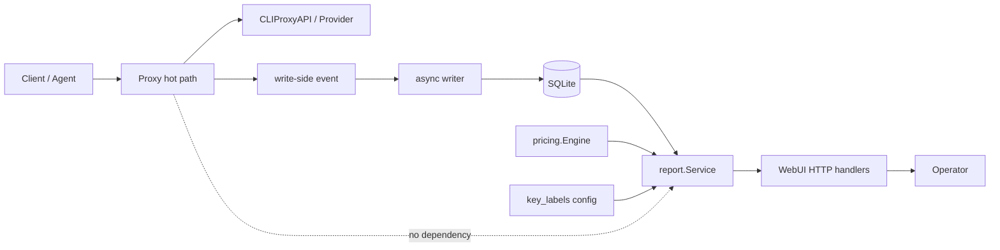

# v0.5.0 Key Insights + Reporting Core

> 状态：实施完成，本地 RC 已通过
> 基线：`v0.4.2`  
> 定位：完整版本交付，不发布阶段性半成品  
> 替代：此前的 `v0.4.0 Keys Ops + Pricing Refresh` 草稿

## 1. 核心结论

本版围绕两条已经确认的产品原则展开：

1. MeteringProxy 继续以透明转发为第一优先级，在尽可能不干扰 LLM 流量的前提下提供计量、成本和网关观测能力。
2. 客户端 API Key 成为正式的一等报表维度，不再只提供请求数、失败数和总 Token 的粗粒度聚合。

本版不是简单地给 Keys 表增加几列，而是交付一条完整纵切：

> 识别 Key → 命名 Key → 查看用量、成本、质量与可信度 → 查看模型和时间分布 → 定位 Issues → 下钻具体请求。

为保证 Key 成本和全局成本一致，本版同时收敛当前分散的读侧报表与成本计算架构。定价数值由项目所有者提供并视为版本输入；实现负责配置结构、严格校验、计算正确性和各报表的一致使用。

本版可以扩大开发周期，但只有全部范围和发布门槛完成后才允许发布。内部 Phase 只是开发顺序，不对应可单独部署的小版本。

---

## 2. 一句话目标与完成定义

### 2.1 一句话目标

在不改变代理转发语义的前提下，让操作者能够针对任意一把客户端 Key，可靠回答：

- 它是谁；
- 最近是否活跃；
- 发起了多少请求、失败多少；
- 使用了哪些模型和端点；
- 消耗了哪些 Token / 图片计费维度；
- 按当前价格配置估算了多少成本；
- 成本和用量是否完整、为什么不完整；
- 最近有哪些问题和具体请求。

### 2.2 完成定义

本版完成不等于“接口能返回新字段”，而是同时满足：

1. Key 总览、Key 详情、模型、趋势、Issues、Requests 形成可操作闭环。
2. 全局、模型、时间桶和 Key 成本使用同一成本内核，结果守恒。
3. long-context 按单次请求判档，不因聚合顺序产生错价。
4. 图片按 Token、输入张数、输出张数和尺寸正确计价，不重复收费。
5. missing usage、request-only、unsupported、conflict 和未定价模型均显式表达为 partial。
6. 所有新增 DB 变更 additive，可从 `v0.4.2` 升级并安全回滚。
7. Proxy 热路径行为和性能基线不退化。
8. 测试、迁移、配置预检、健康检查、文档和生产回滚说明全部交付。

---

## 3. 产品对象与边界

### 3.1 本版 Key 的定义

本版 Key 仅指客户端调用 MeteringProxy 时携带的 API Key：

- 数据字段：`request_usage.api_key_hash`；
- 算法：HMAC-SHA256；
- 输出：64 位小写十六进制；
- salt、算法和输出格式继续遵守仓库不变量，不允许修改。

提取优先级保持现状：

1. `Authorization: Bearer <token>`
2. `X-API-Key`
3. `X-Goog-API-Key`
4. Gemini 查询参数 `?key=`

空 Key 在报表中继续归为 `unknown`。

### 3.2 明确不是同一对象

以下对象不得与客户端 Key 对齐：

- CPA 上游 provider credential；
- CPA management key；
- `side_usage_events.api_key_hash`。

`side_usage_events.api_key_hash` 的输入命名空间与 `request_usage.api_key_hash` 不同。side-channel 与请求的关联仍以经过验证的 `request_id` 为准，不允许通过 hash 猜测关联。

### 3.3 使用场景

“朋友共享中转”是本版的明确使用场景之一，但产品模型仍是“按客户端 Key 区分”，而不是朋友、用户或租户：

- 每个朋友、设备、Agent 或用途可以使用独立 Key；
- MeteringProxy 负责观测和归因；
- Key 的签发、吊销和轮换继续由 CPA 或外围网关负责；
- 本版不引入用户账号、多租户或权限模型。

---

## 4. 版本范围

### 4.1 本版必须交付

#### Key 产品能力

1. Keys 总览增强。
2. 完整 hash → label 配置。
3. 本地安全计算 Key hash 的 CLI。
4. Key 详情视图。
5. Models、Timeseries、Activity、Issues、Requests 的 Key 精确过滤。
6. Key 成本、可信度与 partial 原因。

#### 成本与定价底座

1. 统一读侧成本计算服务。
2. DeepSeek alias。
3. 通用 long-context tier。
4. 图片按张、按尺寸定价。
5. 严格 pricing 配置校验。
6. Overview、Summary、Models、Timeseries、Model Assets、Images、Keys 使用同一成本语义。

#### 架构修复

1. 写侧 Event 与读侧 Report 分离。
2. WebUI handler 不再直接编排 DB 行和 pricing。
3. 以窄接口替代当前宽泛的 `store.ReportStore`。
4. 位置参数查询改为 typed filter。
5. 核心报表移除弱类型 `map[string]interface{}`。
6. DB 报表查询支持 `context.Context` 和取消。
7. Issues 多来源查询不再静默吞错。
8. 消除 Models 来源统计的 N+1 查询。

#### 生产增强

1. API 精确路由与方法限制。
2. 安全、稳定的 JSON 错误契约。
3. `/healthz` 与 `/readyz`。
4. 配置预检命令。
5. 报表查询错误和耗时指标。
6. Key 查询索引、查询计划和大数据量验证。
7. Docker healthcheck、README、升级和回滚文档。

### 4.2 本版明确不做

以下能力不留配置、不留空表、不留未启用 checker，也不以“以后补完”的半成品形式进入代码：

- Key 预算；
- Webhook 告警；
- 后台预算 goroutine；
- quota enforcement、429 或拒绝转发；
- Key 签发、吊销、轮换和在线编辑；
- 用户、租户、登录和支付；
- pricing 在线更新或外部价格同步；
- Key 配置热重载；
- Prometheus 的 Key / model 高基数 label。

### 4.3 移至下一版本的复杂工作

以下问题真实存在，但不与本版同时修改，以避免一个生产版本同时触碰两条高风险底层主线：

1. SSE 大响应和非流式大响应的分配优化。
2. `prefixTailBuffer` / response sampler 的 ring buffer 重构。
3. WebSocket、Realtime 和通用 HTTP Upgrade 隧道。
4. 完整 `doctor` 命令与外部依赖诊断。
5. 顺序化破坏性数据库迁移框架和导出/导入逃生舱。
6. `request_usage` / `health_metrics` 主数据保留策略。
7. `main.go` 完整 Application 生命周期和后台任务管理重构。
8. WebUI 前端模块化或框架迁移。

这些工作后移不代表忽略。尤其响应侧分配问题已经有 pprof 证据，应成为 `v0.6.0` 的优先候选；但本版不修改 Proxy 解析循环。

---

## 5. 当前代码审计结论

### 5.1 已确认的良好基线

截至 2026-07-22，当前 `v0.4.2`：

- `go test ./...` 通过；
- `go vet ./...` 通过；
- CI 已运行 `go test -race ./...`；
- Proxy、Extractor、Writer、Pricing 等核心包已有较扎实的测试；
- salt fingerprint、compressed SSE 诊断、usage confidence、模型资产和 quota 状态收敛已经落地；
- Proxy 和 request-only 路径已有 benchmark / golden test 基线。

因此本版不是推翻现有系统，而是在保持热路径不变量的前提下重构读侧。

### 5.2 当前必须修复的正确性问题

#### 1. 成本逻辑分散且语义不一致

当前成本计算散落在多个 WebUI handler：

- Overview；
- Summary；
- Models；
- Timeseries；
- Model Assets；
- Images。

不同路径对 DB 错误、未定价模型、图片模型、missing usage 和 `cost_known` 的处理并不一致。例如 Summary 会忽略 Models / ImageModels 查询错误，Model Assets 没有携带完整 cache / reasoning 维度。新增 Key 成本如果继续复制这套逻辑，会进一步扩大漂移。

#### 2. long-context 不能在模型聚合后判档

当前 Models 和 ModelTimeseries 先按模型聚合 Token，再调用 pricing。若直接给 `computeCost` 增加 threshold，两次各自低于阈值、合计高于阈值的请求会被错误计入 long 档。

本版必须先按单次请求判档，再聚合成本。

#### 3. 图片报表缺少按张计价所需分桶

`image_usage` 保存了 `size`、`image_count` 和 `input_image_count`，但当前 `ImageModelRow` 只按 model + operation 聚合，丢失了 size 和输入图片数，无法正确支持 1K / 2K 与输入图片价格。

#### 4. 报表层存在静默吞错

当前可见问题包括：

- Summary 忽略 Models / ImageModels 错误；
- Gateway Capabilities 忽略 DB 错误；
- Models 循环查询来源统计时忽略单模型错误；
- Issues 的 side-channel、credential、quota 子查询失败后静默返回已有结果；
- Overview 的 percentile 子查询错误会退化成零值。

静默降级本身不是问题，问题是 API 没有表达“本次结果已降级”。本版要区分：

- 核心查询失败：返回稳定 5xx API 错误；
- 可选子来源失败：返回已有数据，同时标记 partial 和失败来源。

#### 5. Models 来源统计存在 N+1 查询

当前 Models 先查询模型列表，再为每个模型分别查询 `model_returned_source` 和 `usage_source` 计数。单读连接下，这会随模型数线性放大查询次数。

本版改为一次或固定次数的 set-based 聚合，禁止 Key 详情重复引入同类 N+1。

### 5.3 当前架构层面的主要问题

#### 1. `internal/event` 混合写事件和读报表

`event.Event` 属于 Proxy → Writer → DB 写侧；`event/report.go` 与 DB → WebUI 映射属于读侧。两个方向放在同一包中，使依赖边界和命名失真。

#### 2. WebUI 同时承担 HTTP、查询编排、成本计算和领域聚合

当前 `webui.Server` 同时依赖 DB、Pricing、Writer、Registry 和多个 Poller。handler 内直接组合 SQL 行、计算成本、判断 partial 并构造 JSON，导致业务语义难以复用和测试。

#### 3. `store.ReportStore` 过宽并泄漏 DB 类型

当前接口包含二十多个无关方法，同时返回 `db.*Row`。它并没有真正隔离 WebUI 与持久层，只是把一个大接口放在中间。

#### 4. 核心报表依赖弱类型 map

Overview 和部分 diagnostics 使用 `map[string]interface{}`，字段名、字段类型和 optional 语义只能靠运行时约定，容易出现拼写错误、断言失败和 API 漂移。

#### 5. 报表查询缺少取消传播

当前 DB read methods 大多使用 `Query` / `QueryRow`，不接收 request context。浏览器离开页面或请求超时时，SQLite 查询仍可能继续占用唯一读连接。

#### 6. API 路由和错误契约不够严格

当前 API 通过路径 suffix 匹配，绝大多数 GET handler 不验证 HTTP method，并直接把 `err.Error()` 返回给客户端。该行为不利于稳定 API、错误分类和内部信息控制。

### 5.4 已有性能证据与本版判断

现有 benchmark / pprof 已确认：

- request-only 大 body 路径表现良好，应保持；
- 默认 4KB request prefix 不是当前主要瓶颈；
- 主要分配热点在 SSE 逐事件解析、非流式 response sampler 和大 JSON extraction。

本版不触碰这些 Proxy 热路径。只优化新增和现有报表读路径：

- set-based 查询；
- 消除 N+1；
- 组合索引；
- context cancellation；
- 查询计划与大数据量 benchmark；
- 低基数报表指标。

---

## 6. 目标架构



### 6.1 依赖方向

目标依赖关系：

```text
proxy/extractor -> event -> writer -> store.EventSink -> db

db -> report.Service <- pricing
             |
           webui
```

约束：

- Proxy 不依赖 report、pricing 报表编排或 WebUI；
- report 可以依赖 pricing 和窄化的 DB reader interface；
- webui 只负责 HTTP 参数、状态码、缓存头和 JSON；
- pricing 不依赖 DB、WebUI 或 HTTP；
- event 保留写侧事件与捕获语义常量，不再承载读侧 JSON report。

### 6.2 新增 `internal/report`

`internal/report` 负责：

- 读侧 Report DTO；
- DB row → report 的映射；
- Key label 解析；
- usage confidence 聚合；
- 成本编排和 `CostState`；
- Overview / Summary / Models / Timeseries / Keys / Issues / Images 的组合；
- optional source error → partial 的统一规则。

建议文件：

```text
internal/report/
  service.go
  types.go
  filters.go
  cost.go
  confidence.go
  issues.go
  mapping.go
  service_test.go
```

### 6.3 接口隔离

不再保留一个由 WebUI 直接依赖的超大 `store.ReportStore`。由 `report` 作为消费者定义窄接口，例如：

- `UsageReader`
- `CostReader`
- `IssueReader`
- `HealthReader`
- `ManagementReader`

`*db.DB` 可以同时满足这些接口；`report.Service` 只接收其实际需要的接口。`internal/store` 继续保留写侧 `EventSink`、`HealthWriter` 和 poller store，不承担读侧领域编排。

### 6.4 WebUI handler 目标形态

handler 只做：

1. 精确路由和 method 校验；
2. 解析、验证 query；
3. 调用 `report.Service`；
4. 写出 typed JSON 或稳定错误。

handler 不再：

- 循环调用 DB 计算来源计数；
- 直接调用 pricing；
- 组合图片和文本成本；
- 使用弱类型 map 修改 report；
- 静默忽略底层查询错误。

---

## 7. Key 功能规格

### 7.1 `GET /api/keys` 增强

保持返回数组和全部旧字段，新增字段如下：

```json
{
  "key_hash": "0123456789abcdef...",
  "label": "friend-a",

  "request_count": 120,
  "failed_count": 3,
  "failure_rate": 0.025,
  "model_count": 4,

  "input_tokens": 100000,
  "output_tokens": 50000,
  "reasoning_tokens": 5000,
  "cached_tokens": 20000,
  "cache_creation_tokens": 0,
  "total_tokens": 150000,

  "avg_latency_ms": 1800,
  "avg_ttfb_ms": 420,

  "estimated_cost": 1.23,
  "cost_known": true,
  "cost_state": "complete",
  "unpriced_models": 0,
  "missing_usage_count": 0,
  "partial_reasons": [],

  "usage_confidence_counts": {
    "observed": 115,
    "side_channel": 3,
    "request_only": 1,
    "missing_usage": 1,
    "unsupported": 0,
    "conflict": 0
  },

  "latest_seen_at": "2026-07-22T12:00:00Z"
}
```

字段语义：

- `failed_count`：保持现状，HTTP status ≥ 400；
- `failure_rate`：`failed_count / request_count`；
- `model_count`：当前 range 内不同 effective model 数；
- `estimated_cost`：按当前启动时加载的 pricing 对已观测用量重估的已知小计，不是冻结账单；
- `unpriced_models`：当前 Key 下不同未定价 effective model 的数量，不是请求数；
- `latest_seen_at`：当前 range 内最后一条请求时间；
- `cost_known`：保留兼容字段，表示已观测的计费维度是否都有价格；
- `cost_state`：表达价格与用量整体完整性。

### 7.2 CostState

稳定枚举：

| State | 含义 |
|---|---|
| `complete` | 已观测计费维度均可计价，且未发现影响完整性的 usage 状态 |
| `partial` | 可返回已知成本小计，但存在缺失、冲突、默认假设或未定价维度 |
| `unavailable` | 成本子查询或 pricing 服务失败，不能提供可靠小计 |

稳定 partial reason：

- `unpriced_model`
- `missing_usage`
- `request_only`
- `unsupported`
- `usage_conflict`
- `image_count_missing`
- `image_size_defaulted`
- `cost_query_failed`

`partial_reasons` 去重并按固定顺序返回，避免 UI 抖动和测试不稳定。

### 7.3 `unknown` Key

- API 继续以 `key_hash: "unknown"` 返回；
- UI 可以点击并下钻无 Key 流量；
- `key_labels` 不接受 `unknown`；
- `hash-key` 不会产生 `unknown`；
- 所有 Key 守恒验收必须包含 `unknown`。

### 7.4 Key labels

```yaml
key_labels:
  "0123456789abcdef0123456789abcdef0123456789abcdef0123456789abcdef": "friend-a"
  "abcdef0123456789abcdef0123456789abcdef0123456789abcdef0123456789": "self"
```

校验：

- key 必须为完整 64 位小写 hex；
- label 自动 trim；
- label 不得为空、不得包含控制字符；
- label 长度设置合理上限；
- label 允许重复，方便 Key 轮换后保留同一用途名称；
- API 和日志永不返回明文 Key；
- UI 对 label 做 HTML escape。

配置在进程启动时加载。本版不做热重载，修改后需要受控重启。

### 7.5 本地 `hash-key` 命令

目标命令：

```text
ai-gateway-metering-proxy hash-key --config config.yaml
```

规则：

- 从 stdin 读取 Key；
- 不接受 `--key` 参数，避免 shell history 和 process list 泄漏；
- 使用配置指向的 salt 文件及当前 HMAC 算法；
- 只向 stdout 输出 64 位 hash；
- 不访问网络、不打开或修改 DB；
- 不记录输入长度、前后缀或任何明文日志。

现有无子命令的启动方式保持兼容，等价于 `serve`。

### 7.6 Key scope

以下接口新增同名精确过滤：

```http
GET /api/models?range=24h&key_hash=<full-hash|unknown>
GET /api/timeseries?range=24h&bucket=1h&key_hash=<full-hash|unknown>
GET /api/activity?range=24h&key_hash=<full-hash|unknown>
GET /api/issues?range=24h&limit=20&key_hash=<full-hash|unknown>
GET /api/requests?range=24h&limit=100&key_hash=<full-hash|unknown>
```

规则：

- 只接受完整 hash 或 `unknown`；
- 不支持 prefix；
- 非法值返回 400；
- Key filter 可以与 status、model、endpoint、error_class 组合；
- Models、Timeseries、Activity 的统计口径与无 Key filter 时完全一致；
- Key-scoped Issues 只返回 `request_usage` 中属于该 Key 的问题，不混入全局 credential、quota、side-channel 或 process system issue；
- 全局 Issues 页面继续展示全部来源。

### 7.7 Key Detail WebUI

点击 Keys 表行后，在当前页面打开 Key Detail 区域，继承全局 range，并显示：

1. label、short hash、复制完整 hash；
2. 请求、失败率、Token、成本、latest seen；
3. P95 latency / TTFB 与 usage confidence；
4. 请求量、Token、成本趋势；
5. 按模型分布；
6. Key-scoped Issues；
7. Key-scoped 最近请求。

列表默认列：

- Label / Key
- Requests
- Fail %
- Tokens
- Estimated cost
- Cost state
- Latest seen

详细 Token、confidence 和 latency 放入详情，避免总览表过宽。

交互约束：

- 自动刷新后保持选中 Key；
- range 变化时刷新详情；
- Key 在新 range 无数据时显示明确空状态；
- partial / unavailable 不以 `$0.00` 冒充完整成本；
- 中英文 i18n 同步；
- 不增加在线编辑、删除或停用按钮。

---

## 8. 统一成本与定价设计

### 8.1 分层职责

`internal/pricing` 只负责：

- 加载和校验 pricing；
- model / alias / canonical 名解析；
- 给定完整 UsageVector 后计算一个价格结果；
- 不查询 DB，不理解 HTTP range 或 Key。

`internal/report` 负责：

- 从 DB 获取价格同质的 usage buckets；
- 正确处理 request-level tier；
- 聚合到 global / model / time bucket / key；
- 合并文本和多模态成本；
- 生成 CostState 和 partial reasons。

### 8.2 UsageVector

定价输入至少需要表达：

- model；
- input / output / reasoning / cached / cache creation tokens；
- request input tokens，用于 tier 判定；
- modality / channel / direction / metric / unit；
- input image count；
- output image count；
- normalized image size；
- capture mode / usage confidence。

不得只向 pricing 传一个跨请求聚合后的 `total_tokens`。

### 8.3 价格同质分桶

为兼顾正确性和查询性能，报表不要求把所有请求完整加载进 Go：

1. 无 tier 的文本模型可以按 scope + model 线性聚合；
2. 有 tier 的模型必须先按单请求 threshold 分类，再按 short / long bucket 聚合；
3. 图片按 scope + model + operation + normalized size 聚合；
4. 同一个 bucket 内的单价必须相同；
5. 所有报表基于同一批 cost buckets 再分组，保证守恒。

实现可选择 SQL CASE 或最小 request rows + Go 分类，但必须通过大数据量 benchmark。禁止为每个 Key 或每个模型发起独立成本查询。

### 8.4 long-context

`long_context` 是通用可选结构，只允许用于存在明确阈值的模型。以仓库已经记录了 200k 分界的 Gemini 3.1 Pro 为配置示例：

```yaml
pricing:
  gemini-3.1-pro-preview:
    input_per_1m: 2.00
    cached_input_per_1m: 0.20
    output_per_1m: 12.00
    long_context:
      threshold_input_tokens: 200000
      input_per_1m: 4.00
      cached_input_per_1m: 0.40
      output_per_1m: 18.00
```

Grok 4.5 的 short / long 分界没有经过项目所有者确认，因此本版不得猜测阈值。默认配置固定使用已确认的低档价：input `2.00`、cached input `0.30`、output `6.00`，且不写 `long_context`。正式 `pricing.yaml` 中任何启用的 tier 都必须包含正整数阈值，placeholder 或 0 必须校验失败。

判定：

```text
single_request.input_tokens >= threshold_input_tokens -> long price
otherwise -> short price
```

边界测试：

- threshold - 1；
- threshold；
- threshold + 1；
- 两个请求各低于 threshold、合计高于 threshold；
- cached / reasoning / cache creation 在 short 和 long 下分别计价。

该能力做成通用 ModelPrice 结构，并修复当前 Gemini 3.1 Pro 已记录但未实现的 tier 缺口，不写任何模型专属分支。

### 8.5 DeepSeek aliases

```yaml
pricing:
  deepseek-v4-flash:
    input_per_1m: 0.14
    cached_input_per_1m: 0.0028
    output_per_1m: 0.28
    aliases:
      - ds-openai-flash

  deepseek-v4-pro:
    input_per_1m: 0.435
    cached_input_per_1m: 0.003625
    output_per_1m: 0.87
    aliases:
      - ds-openai-pro
```

alias 引擎已有基础，本版补配置和严格验证：

- alias 不得为空；
- 同一 alias 不得属于多个 canonical model；
- alias 与其他 canonical model 名冲突时拒绝加载；
- 重复配置不得依赖 Go map 随机迭代顺序决定结果；
- exact canonical 仍优先于 canonicalization。

### 8.6 图片按张计价

```yaml
multimodal_pricing:
  grok-imagine-image-quality:
    aliases:
      - grok-imagine-image
    image:
      per_image_input: 0.01
      per_image_output:
        "1K": 0.05
        "2K": 0.07
        default: 0.05
```

规则：

- 输入图片：`input_image_count × per_image_input`；
- 输出图片：`image_count × per_image_output[normalized_size]`；
- `1024*` 归一为 `1K`；
- `2048*` 或显式 `2K` 归一为 `2K`；
- 未知 / 缺失 size 使用 `default`，同时标记 `image_size_defaulted`；
- 缺失输出 `image_count` 时不猜测成功张数，标记 `image_count_missing`；
- request-only 不能冒充完整 output cost；
- Token 通道与 per-image 通道在同一 multimodal price 内按配置相加。

避免重复计费：

- 识别为 image request 且命中 `multimodal_pricing` 时，使用 multimodal usage dimensions 与 per-image 价格；
- 不再额外把同一 `request_usage` token summary 按普通文本价格重复加入；
- 同一 model 可以在普通文本请求中使用 `pricing`，在图片请求中使用 `multimodal_pricing`。

### 8.7 Pricing 严格校验

启动和 `validate` 命令必须检查：

- 未知 YAML 字段；
- 负价格；
- tier threshold 缺失、为 0 或为负；
- short / long 所需字段缺失；
- duplicate alias；
- canonical / alias 冲突；
- per-image output 缺少 default；
- 非法 resolution key；
- 不支持的 metric / unit 组合。

所有错误包含 YAML 路径，但不得输出 salt、Key 或 management key。

### 8.8 历史成本语义

本版仍不把价格写入每条请求。所有成本是：

> 当前进程加载的 pricing 对历史已观测 usage 的重新估算。

因此更新 pricing 会重估历史报表。README 必须明确其用途是运营估算，不是不可变账单或支付结算依据。

---

## 9. 报表与 API 架构修复

### 9.1 Typed filters

以 typed filter 替代位置参数，例如：

```go
type Scope struct {
    Since   time.Time
    KeyHash string
}

type RequestFilter struct {
    Scope
    Limit      int
    StatusMin  int
    StatusMax  int
    Model      string
    Endpoint   string
    ErrorClass string
}

type IssueFilter struct {
    Scope
    Limit         int
    IncludeGlobal bool
}
```

具体包位置可以按依赖方向调整，但禁止继续给 `Requests(...)` 增加第八、第九个位置参数。

### 9.2 Context propagation

- WebUI request context 传入 report service；
- report service 传入 DB query；
- 使用 `QueryContext` / `QueryRowContext`；
- 浏览器取消、服务器 shutdown 或 handler timeout 后停止等待查询；
- 后台 poller 使用自身 lifecycle context，不复用 HTTP context。

### 9.3 Overview typed contract

核心 usage / cost 报表全部使用 typed struct。Overview 至少拆分为：

- SelectedRange
- RecentActivity
- CaptureHealth
- CostSummary
- SectionStatus / ErrorCode

不再由 handler 对 `map[string]interface{}` 做运行时断言和字段注入。

CPA quota / observability diagnostics 中尚未触及的复杂 map 可以暂时保留；本版的完整边界是“核心 usage、cost、key、issues 报表 typed”，不是一次性重写所有 management JSON。

### 9.4 Optional source error

Issues 等多来源报表新增来源状态，例如：

```json
{
  "partial": true,
  "sources": {
    "request_usage": "complete",
    "side_channel": "unavailable",
    "credential_health": "complete",
    "quota": "complete"
  }
}
```

规则：

- 不再在 DB helper 内吞错；
- report service 负责决定 atomic failure 或 partial；
- Key-scoped Issues 只启用 `request_usage` source；
- source error 对外返回稳定 code，对内日志保留原始 error；
- 不把 DB 文件路径、SQL 或内部网络地址直接返回浏览器。

### 9.5 消除 N+1

Models 的 model source / usage source breakdown 改为 set-based 查询：

- 一次主模型查询；
- 最多固定数量的来源聚合查询；
- 在 Go 中按 model 合并；
- 查询次数不随模型数量增长。

Keys confidence、Key Models 和成本也遵守同一规则。

### 9.6 API 精确路由与方法

- 使用 base path 下的精确相对路径匹配，不使用任意 suffix；
- 所有只读 API 只接受 GET；
- refresh / reset 等已有动作只接受 POST；
- method 错误返回 405 并带 `Allow`；
- 未知 API 返回 JSON 404；
- 静态资源路由保持现状。

### 9.7 稳定错误格式

```json
{
  "error": {
    "code": "invalid_key_hash",
    "message": "key_hash must be a 64-character lowercase hex value"
  }
}
```

错误分类至少包括：

- `invalid_range`
- `invalid_key_hash`
- `invalid_filter`
- `report_query_failed`
- `cost_unavailable`
- `method_not_allowed`
- `not_found`

内部 error 记录到服务日志；外部 message 稳定、可本地化且不泄漏内部信息。`writeJSON` 的编码错误也必须记录，不能继续无条件忽略。

### 9.8 API 兼容

- 现有 endpoint 保留；
- `/api/keys` 继续返回数组；
- 旧 JSON 字段不删除、不改名；
- 新字段 additive；
- `cost_known` 保留，新语义在 README 明确；
- 无 `key_hash` 时的行为与 `v0.4.2` 等价；
- 只改变非法 query 从静默默认到明确 400 的行为。

---

## 10. 数据库与查询设计

### 10.1 Schema 变化

本版默认不新增业务表，不写入 cost，也不保存 label：

- `request_usage` 保持 append-only；
- `key_labels` 只存在配置内；
- cost 只在读侧计算；
- 新增索引属于 additive migration。

建议索引：

```sql
CREATE INDEX IF NOT EXISTS idx_request_usage_key_created_at_unix
ON request_usage(api_key_hash, created_at_unix);
```

是否增加覆盖列必须依据 `EXPLAIN QUERY PLAN` 和 benchmark，不为了理论优化建立过宽索引。

### 10.2 查询原则

- Key 精确过滤使用 `=`，不使用 prefix LIKE；
- `unknown` 映射为空 / NULL hash 的现有语义；
- 所有 range 查询优先使用 Unix 时间列；
- 成本查询 set-based；
- 不按 Key 循环查询 Models；
- 不按 Model 循环查询来源；
- recent requests 始终有 limit；
- 默认不增加 read connection pool，保留单读连接的背压，除非 benchmark 证明调整有明确收益。

### 10.3 迁移风险

SQLite 创建新索引可能延长首次升级启动时间。发布前必须：

1. 在 `v0.4.2` 生产规模快照副本上测试；
2. 记录索引创建耗时和 DB / WAL 大小变化；
3. 升级前备份 DB + salt；
4. 明确首次启动维护窗口；
5. 确认旧二进制可忽略新索引并正常打开 DB。

不在本版借机引入破坏性 migration registry；当前只有 additive index，不需要扩大迁移风险。

### 10.4 查询性能验证

新增专用 benchmark / fixture，至少覆盖：

- 100 万 `request_usage` 行；
- 100 个不同 Key；
- 100 个模型 / alias 组合；
- 24h / 7d / 30d；
- Key list；
- 单 Key models / timeseries / activity / issues / requests；
- global 与 Key cost；
- 有 tier 模型和 image_usage 的混合数据。

验收重点：

- 查询计划命中时间或 Key 组合索引；
- 查询次数固定，不随 Key / model 数 N+1 增长；
- 取消请求能释放读连接；
- 报表查询不会持有 writer 锁；
- Proxy benchmark 在并发报表查询时不出现明显回退。

本版优先优化 SQL 和查询边界，不引入复杂 report cache。只有 benchmark 证明仍不满足目标时，下一版再设计带明确失效语义的缓存。

---

## 11. 生产可靠性增强

### 11.1 `/healthz`

```http
GET /healthz
```

语义：进程和 HTTP server 存活即返回 200，不访问 DB、pricing、upstream 或 CPA。

### 11.2 `/readyz`

```http
GET /readyz
```

检查：

- 启动配置已加载；
- salt 已加载且 fingerprint 启动检查通过；
- pricing 已加载并通过严格校验；
- SQLite read/write handle 可用；
- async writer 已启动。

不检查：

- upstream 是否在线；
- provider 是否在线；
- CPA management 是否可用；
- quota 是否 available。

这些外部状态不应让透明代理实例被编排器反复重启。

响应不包含 DB 路径、salt 路径、management URL 或 Key。

### 11.3 Docker healthcheck

Dockerfile 增加使用本地 `/healthz` 或 `/readyz` 的 healthcheck，并在 README 解释二者差异。实现不得为 healthcheck 额外安装重量级运行时依赖。

### 11.4 配置预检

目标命令：

```text
ai-gateway-metering-proxy validate --config config.yaml
```

检查：

- config 语法与字段；
- upstream URL 格式；
- pricing 语法和严格语义；
- key_labels；
- salt 文件存在、可读和权限；
- management key file 在启用时可读。

默认不访问网络、不迁移 DB、不写任何文件。完整 Doctor 与 upstream / CPA 探测移至下一版。

现有：

```text
ai-gateway-metering-proxy --config config.yaml
```

保持可用，并作为默认 `serve` 路径。

### 11.5 报表指标

在现有手写 Prometheus exposition 上增加低基数指标：

- `metering_proxy_report_queries_total{report="keys"}`
- `metering_proxy_report_query_errors_total{report="keys"}`
- `metering_proxy_report_query_duration_ms_sum{report="keys"}`
- `metering_proxy_report_query_duration_ms_count{report="keys"}`

允许的 `report` 值为代码内固定枚举。禁止加入：

- `key_hash`
- model
- endpoint
- request_id
- label

### 11.6 CLI 与 main 的有限重构

为支持 `serve`、`validate` 和 `hash-key`，将命令解析抽成可测试的 `run(args, stdin, stdout, stderr) error` 或等价边界，`main()` 只负责退出码和最终日志。

本版不进一步重写全部应用生命周期、poller orchestration 或 goroutine 管理；该工作单独进入下一版本。

---

## 12. 配置与文档交付

### 12.1 `config.yaml`

新增：

```yaml
key_labels:
  "0123456789abcdef0123456789abcdef0123456789abcdef0123456789abcdef": "friend-a"
```

无该字段时行为与当前版本一致。

### 12.2 `pricing.yaml`

新增或扩展：

- DeepSeek aliases；
- `long_context`；
- `per_image_input`；
- `per_image_output`；
- 严格校验要求。

最终数值以本文件中项目所有者确认的数值为 release input。Grok 4.5 使用固定低档价；只有已知阈值的模型启用 `long_context`。正式发布文件不得包含 placeholder、TBD 或无法命中的空结构。

### 12.3 README

必须补充：

1. 按 Key 区分的定位和使用场景；
2. 如何给朋友、设备、Agent 或用途分配独立 Key；
3. `hash-key` 使用；
4. `key_labels`；
5. Key Detail 和 partial 状态解释；
6. 当前价格重估历史用量的语义；
7. `validate`；
8. health / readiness；
9. 升级、迁移和回滚；
10. WebUI 必须由 Caddy Basic Auth 或等效机制保护。

### 12.4 Demo data

当前 demo 使用非 64 hex 的占位 hash。本版必须改为合法 HMAC 形态的测试 hash，并覆盖：

- 两个带 label 的 Key；
- 一个未标记 Key；
- `unknown`；
- 一个 partial Key；
- 一个 long-context request；
- 1K / 2K 图片请求；
- 可下钻 issues 和 requests。

Demo 数据不得包含真实 Key 或可逆信息。

---

## 13. 实施顺序

### Phase 0 — 契约冻结与保护线

1. 固定本文件中的 API、CostState、partial reason 和 Key scope。
2. 保存当前 Proxy benchmark / golden test 基线。
3. 建立人工可核算的文本、tier、图片和多 Key fixtures。
4. 明确不修改 `internal/proxy` 生产行为。

完成门槛：测试能够在重构前描述当前行为和目标行为。

### Phase 1 — 读侧架构重构

1. 新建 `internal/report`。
2. 移动 read-side DTO 和 mapping。
3. 引入窄 reader interfaces。
4. WebUI 核心 handler 改为依赖 report service。
5. 核心 Overview / cost report typed。
6. DB read methods 接入 context 和 typed filters。

完成门槛：除明确修复项外，现有 API fixture 不变；旧测试全绿。

### Phase 2 — 成本内核与现存缺陷修复

1. 统一 CostResult / CostState。
2. 修复 handler 吞错和 partial 语义。
3. 消除 Models N+1。
4. 实现 strict pricing validation。
5. 实现 alias、generic long-context、per-image。
6. 所有成本 API 切换到同一服务。

完成门槛：全局 / 模型 / 时间桶 / 图片成本守恒；tier 和图片 fixtures 人工核算一致。

### Phase 3 — Key DB 与 API

1. Key aggregate 完整字段。
2. Key confidence / partial。
3. Models / Timeseries / Activity / Issues / Requests exact filter。
4. Issues source error 收敛。
5. 新组合索引与查询计划测试。
6. API method、error contract 和 filter validation。

完成门槛：两把 Key、unknown、混合模型和 partial 数据完全隔离且守恒。

### Phase 4 — Key WebUI 与 CLI

1. Keys table 增强。
2. Key Detail。
3. label + copy full hash。
4. `hash-key`。
5. `validate`。
6. 中英文、空状态、错误状态和 partial 状态。

完成门槛：操作者无需直接查询 SQLite 即可完成完整 Key 排查流程。

### Phase 5 — 生产增强与性能验收

1. healthz / readyz。
2. Docker healthcheck。
3. report metrics。
4. 100 万行 benchmark / query plan。
5. v0.4.2 DB 升级和回滚演练。
6. README、配置与 release notes。
7. `go test -race ./...`、vet、build、Docker build。

完成门槛：全部发布门槛通过后才能合并、打 tag 和部署。

---

## 14. 测试与验收矩阵

### 14.1 Key 聚合

- [ ] 两把完整 hash 分别聚合；
- [ ] `unknown` 单独聚合；
- [ ] label 命中和缺失；
- [ ] request / failed / failure rate；
- [ ] input / output / reasoning / cached / cache creation / total；
- [ ] model count；
- [ ] avg latency / TTFB；
- [ ] latest seen；
- [ ] confidence breakdown；
- [ ] partial reasons 稳定排序。

### 14.2 Key scope API

- [ ] Models；
- [ ] Timeseries；
- [ ] Activity；
- [ ] Issues；
- [ ] Requests；
- [ ] 多过滤条件组合；
- [ ] 非法 hash 400；
- [ ] prefix 拒绝；
- [ ] `unknown` filter；
- [ ] Key Issues 不混入全局系统项。

### 14.3 成本

- [ ] 普通输入 / 输出；
- [ ] cached input；
- [ ] cache creation；
- [ ] reasoning；
- [ ] alias；
- [ ] alias 冲突拒绝；
- [ ] long threshold -1 / exact / +1；
- [ ] 两次 short 聚合后仍为 short 价格之和；
- [ ] 1K / 2K output images；
- [ ] input images；
- [ ] 缺 size 使用 default 且 partial；
- [ ] 缺 image count partial；
- [ ] image request 不与 text summary 双计费；
- [ ] 未定价模型；
- [ ] missing / request-only / unsupported / conflict；
- [ ] global = Σ models = Σ keys = Σ time buckets（允许浮点舍入容差）。

### 14.4 架构与错误

- [ ] WebUI 核心 handler 不直接调用 pricing；
- [ ] 无 Models / Keys N+1；
- [ ] DB optional source error 不被吞掉；
- [ ] request cancellation 终止查询；
- [ ] API 不返回原始 DB / SQL error；
- [ ] method 405 + Allow；
- [ ] exact routing；
- [ ] JSON encode error 有日志；
- [ ] typed Overview contract fixture。

### 14.5 配置与 CLI

- [ ] 无 labels 配置兼容；
- [ ] 非法 hash、空 label、控制字符拒绝；
- [ ] pricing 未知字段拒绝；
- [ ] 负价格拒绝；
- [ ] threshold placeholder / 0 拒绝；
- [ ] `validate` 不写 DB、不访问网络；
- [ ] `hash-key` 与运行时 HMAC 完全一致；
- [ ] `hash-key` 不输出明文；
- [ ] 旧 `--config` 启动方式兼容。

### 14.6 健康与生产

- [ ] healthz 不访问依赖；
- [ ] readyz 正常 / DB 不可用；
- [ ] upstream 不可达不触发 readiness 重启；
- [ ] Docker healthcheck；
- [ ] v0.4.2 DB 迁移；
- [ ] 迁移中断后可恢复；
- [ ] 旧二进制可打开新增索引后的 DB；
- [ ] Proxy tests 全绿；
- [ ] Proxy benchmark 不显著回退；
- [ ] 并发报表查询不阻塞正常转发；
- [ ] 无明文 Key、prompt 或响应体进入 DB、日志、API。

### 14.7 必跑命令

```text
go test ./...
go test -race ./...
go vet ./...
go build -o ai-gateway-metering-proxy .
docker build -t ai-gateway-metering-proxy:v0.5.0-rc .
```

性能 benchmark 和 migration smoke 必须形成可保存的结果，不以一次人工观察代替。

---

## 15. 发布、升级与回滚

### 15.1 不发布半成品

- 开发可以分 commit；
- 开发应在版本分支完成；
- 不把只完成 Phase 1 / 2 的 edge 构建当作可部署版本；
- 只有 Phase 0–5 全部通过才合并、tag 和发布。

### 15.2 升级顺序

1. 备份 SQLite、WAL/SHM、salt、config、pricing；
2. 使用新二进制执行 `validate`；
3. 在 DB 副本验证迁移与查询；
4. 替换 binary + config + pricing 作为一个 release bundle；
5. 启动并检查 readyz、metrics、WebUI；
6. 执行两把测试 Key 的 live smoke；
7. 确认 Proxy 和 Key cost 后完成升级。

### 15.3 回滚注意

DB 只增加索引，旧二进制可以继续使用。但旧 `v0.4.2` 不理解：

- `long_context`；
- `per_image_input` / `per_image_output`；
- 新的严格 pricing 语义。

因此回滚必须恢复旧 binary 对应的旧 pricing 文件，不能只替换二进制。release bundle 必须版本化保存 binary、config 和 pricing。

### 15.4 失败模型

- Key / cost / WebUI 查询失败不得影响 Proxy handler；
- report error 只影响对应 API；
- pricing / config 在启动前通过 validate；
- writer queue overflow 仍丢计量事件而不阻塞请求；
- 数据不完整时显示 partial，不猜测完整值。

---

## 16. 建议文件改动范围

### 新增

```text
internal/report/*
docs/v0.5.0-key-insights-plan.md
```

### 重点修改

```text
main.go
internal/config/config.go
internal/db/db.go
internal/db/queries.go
internal/event/report.go        # 读侧类型迁出后删除或收窄
internal/event/mapping.go       # 只保留写侧映射
internal/pricing/pricing.go
internal/store/store.go
internal/webui/server.go
internal/webui/handlers.go
internal/webui/static/index.html
internal/webui/static/app.js
internal/webui/static/i18n.js
internal/webui/static/styles.css
internal/metrics/metrics.go
internal/db/demo.go
config.yaml
pricing.yaml
Dockerfile
README.md
```

### 测试

```text
internal/report/*_test.go
internal/pricing/pricing_test.go
internal/db/db_test.go
internal/webui/server_test.go
internal/config/config_test.go
internal/hash/hash_test.go
internal/metrics/metrics_test.go
internal/proxy/*_test.go         # 回归，不因本版改写生产逻辑
```

文件拆分可以随职责迁移进行，但不得把大规模纯移动和行为修改混在同一 commit，避免审查时看不清语义变化。

---

## 17. 下一版本候选

### P0 候选

1. 基于现有 pprof 的 SSE / nonstream allocation 优化。
2. Key observed limits + durable notification state + Webhook。
3. 完整 Doctor 命令。

### P1 候选

1. WebSocket / Realtime / HTTP Upgrade 透明隧道。
2. Application lifecycle 与统一 root context。
3. 破坏性迁移 registry、导出/导入和恢复演练。
4. health_metrics / request_usage retention。
5. report cache（仅在 v0.5.0 benchmark 证明需要时）。

预算若进入下一版，必须作为完整纵切：阈值语义、observed/partial、状态迁移、持久化去重、Webhook timeout/retry/recovered 通知和失败诊断缺一不可。

---

## 18. 最终验收红线

以下任一项不满足，`v0.5.0` 不发布：

1. Proxy method/path/query/header/body/status/SSE bytes 透明性发生非预期变化。
2. 新报表、成本或 Key 查询进入 Proxy 同步热路径。
3. long-context 仍按跨请求聚合 Token 判档。
4. 图片价格因丢失 size / count 被静默算作完整。
5. global、model、timeseries、key 使用不同成本算法。
6. 任一核心报表继续静默吞掉错误并返回看似完整的数据。
7. `/api/keys` 破坏旧字段或返回形状。
8. 明文 Key、prompt、响应正文或内部凭据进入 DB、日志或 API。
9. migration 未在旧 DB 副本验证。
10. 配置或 pricing 仍含 placeholder / TBD。
11. test、race、vet、build、Docker、迁移、回滚或 live smoke 任一未完成。

本版最终应同时得到两项成果：

- 用户层面：Key 成为真正可用、可诊断、可下钻的观测维度；
- 工程层面：读侧报告、成本计算和 WebUI API 从当前分散实现收敛为可维护、可验证的架构边界。
